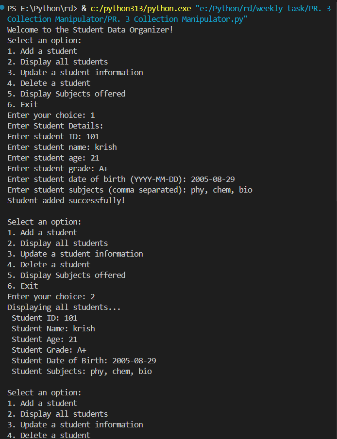
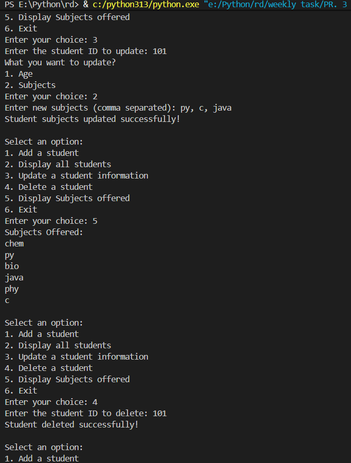
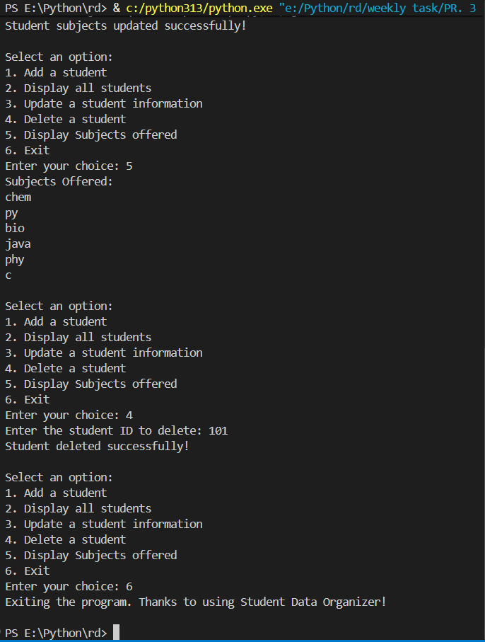

# PR. 3 Collection Manipulator 🎒

## 📌 Project Description

`PR. 3 Collection Manipulator` (Student Data Organizer) is a beginner-friendly Python script that demonstrates basic collection manipulation techniques while managing student records. It provides a simple interactive menu to add, view, update, and delete student data using lists, dictionaries, and sets.

The project demonstrates core Python concepts such as:

- User input and type casting
- Lists, dictionaries and sets
- Looping and searching
- Basic data validation (recommended improvements)
- `match` / pattern matching (Python 3.10+)

---

## 🚀 Features

- Interactive, menu-driven CLI
- Add student records (ID, name, age, grade, DOB, subjects)
- Display all students
- Update student age or subjects (correct ID lookup and syncs both `student_list` and `student_dict`)
- Delete student by ID
- Show aggregated subjects offered

---

## 🛠 Technologies Used

- Python 3.10+
- Standard Library only

---


## 📂 Project Structure

```bash
PR. 3 Collection Manipulator
├── PR. 3 Collection Manipulator.py
├── README.md
├── ss1.png
├── ss2.png
├── ss3.png
└── Explanation Video.mp4
```

If the video is large, host it externally (YouTube, Drive) or use Git LFS instead of committing the raw file.

## ▶️ How the Program Works

1. The program shows a numbered menu and waits for the user's choice.
2. Depending on the option, it adds, displays, updates or deletes student entries kept in memory.
3. Student data is stored in two complementary structures:

- `student_list`: list of student record dicts (used for ordered display)
- `student_dict`: dict keyed by student ID for fast lookup
- `student_subject`: set collecting all subjects seen

The program is designed for interactive runs and does not persist data to disk.

---

## 💻 How to Run

Open a terminal in the project folder and run:

```bash
python "PR. 3 Collection Manipulator.py"
```

Follow the on-screen menu prompts to operate the program.

---

## 🧾 Menu Options

- `1` Add a student — prompts for ID, name, age, grade, DOB (YYYY-MM-DD), and comma-separated subjects.
- `2` Display all students — prints every student record saved during this session.
- `3` Update a student — enter an ID, then choose to update age or subjects.
- `4` Delete a student — remove a student by their ID.
- `5` Display Subjects offered — prints aggregate list of subjects.
- `6` Exit — quits the program.

---

## 🧠 Code Explanation (summary)

- Adding a student constructs a dict with a `student_info` tuple `(ID, DOB)` and other fields, appends it to `student_list`, and also stores a simpler dict in `student_dict` for quick lookup.
- Updating searches `student_list` for the matching `student_info` ID and updates fields in-place; changes are synced to `student_dict` and subject input is trimmed.
- Deleting removes the entry from both `student_list` and `student_dict`.

Key data structures:

- `student_list` — list of dicts for display order
- `student_dict` — ID -> dict for fast access
- `student_subject` — set of subject strings

---

## 💻 Code Explanation

### Welcome Message and Menu Loop

```python
print("Welcome to the Student Data Organizer!")
student_list = []
student_dict = {}
student_subject = set()

while True:
	print("Select an option:")
	print("1. Add a student")
	print("2. Display all students")
	print("3. Update a student information")
	print("4. Delete a student")
	print("5. Display Subjects offered")
	print("6. Exit")
	n = int(input("Enter your choice: "))
    
	match n:
```

This prints a welcome message, creates the three main collections, and starts an infinite `while True` loop that shows a numeric menu. The user's choice is read with `input()` and converted to `int()`; `match` dispatches to the correct case. If the `int()` conversion fails the program will raise `ValueError` (no try/except present).

---

### Case 1 — Add a student

```python
		case 1:
			print("Enter Student Details:")
			student_id = int(input("Enter student ID: "))
			student_name = input("Enter student name: ")
			student_age = int(input("Enter student age: "))
			student_grade = input("Enter student grade: ")
			student_dob = input("Enter student date of birth (YYYY-MM-DD): ")
			student_subjects = [
				subject.strip()
				for subject in input("Enter student subjects (comma separated): ").split(",")
				if subject.strip()
			]
            
			student_info = (student_id, student_dob)
			dict1 = {
				"student_info" : student_info,
					"name" : student_name,
					"age" : student_age,
					"grade" : student_grade,
					"subjects" : student_subjects
			}
			student_list.append(dict1)
            
			student_dict[student_id] = {
				"name" : student_name,
				"age" : student_age,
				"grade" : student_grade,
				"subjects" : student_subjects
			}
			student_subject.update(student_subjects)
			print("Student added successfully!\n")
```

Step-by-step:
- Reads values using `input()` and converts numeric fields with `int()`.
- `split(",")` turns the comma-separated subjects string into a list; input is trimmed so extra spaces are removed.
- `student_info` is a `tuple` used to store `(ID, DOB)` immutably.
- `dict1` is a `dict` representing the full student record; appended to `student_list` to preserve insertion/display order.
- A simpler record is stored in `student_dict` keyed by `student_id` for O(1) lookup.
- `student_subject.update(student_subjects)` adds each subject into the `set`, deduplicating entries.

Key constructs: `input()`, `int()`, `str.split()`, tuple, dict, `list.append()`, dict assignment, `set.update()`.

---

### Case 2 — Display all students

```python
		case 2:
			if len(student_list) == 0:
				print("No students to display.\n")
			else:    
				print("Displaying all students...")
				for student in student_list:
					print(f" Student ID: {student['student_info'][0]}\n Student Name: {student['name']}\n Student Age: {student['age']}\n Student Grade: {student['grade']}\n Student Date of Birth: {student['student_info'][1]}\n Student Subjects: {', '.join(student['subjects'])}\n")
```

Step-by-step:
- Checks if `student_list` is empty and prints a message if so.
- Otherwise, iterates `for student in student_list:` and prints formatted information using f-strings.
- `student['student_info'][0]` reads the ID from the tuple; `student['student_info'][1]` reads the DOB.
- `', '.join(student['subjects'])` joins the subject list into a readable string.

Key constructs: `if`/`else`, `for` loop, dict and tuple indexing, `str.join()`, f-strings.

---

### Case 3 — Update a student information

```python
		case 3:
			student_id = int(input("Enter the student ID to update: "))
			found = False
			for student in student_list:
				if student["student_info"][0] == student_id:
					found = True
					print("What you want to update?")
					print("1. Age")
					print("2. Subjects")
					choice = int(input("Enter your choice: "))
					match choice:
						case 1:
							new_age = int(input("Enter new age: "))
							student["age"] = new_age
							student_dict[student_id]["age"] = new_age
							print("Student age updated successfully!\n")
						case 2:
							new_subjects = [
								s.strip()
								for s in input("Enter new subjects (comma separated): ").split(",")
								if s.strip()
							]
							student["subjects"] = new_subjects
							student_dict[student_id]["subjects"] = new_subjects
							student_subject.update(new_subjects)
							print("Student subjects updated successfully!\n")
						case _:
							print("Invalid choice\n")
					break
			if not found:
				print("Student not found.\n")
```

Step-by-step:
- Reads the `student_id` to update and searches `student_list` by checking `student["student_info"][0]`.
- If found, prompts a sub-menu to change either `age` or `subjects`.
- Age update assigns a new integer value to `student["age"]` and syncs it to `student_dict[student_id]`.
- Subjects update reads a comma-separated list, trims whitespace, assigns it to the record, updates the corresponding entry in `student_dict`, and adds new subjects into `student_subject`.

Key constructs: loop search, `match` for sub-choice, dict assignment, `split()`, `set.update()`.

---

### Case 4 — Delete a student

```python
		case 4:
			student_id = int(input("Enter the student ID to delete: "))
			found = False
			for student in range(len(student_list)):
				if student_list[student]["student_info"][0] == student_id:
					found = True
					del student_list[student]
					del student_dict[student_id]
					print("Student deleted successfully!\n")
					break
			if not found:
				print("Student not found.\n")
```

Step-by-step:
- Reads the ID, then iterates by index over `student_list` to find the matching record.
- On match, deletes the list element and the `student_dict` entry using `del`, prints success, and `break`s.
- If no match found after the loop, prints "Student not found." once.

Key constructs: `range(len(list))` index-based loop, `del` for list and dict removal, `break`.

---

### Case 5 — Display Subjects offered

```python
		case 5:
			if len(student_subject) == 0:
				print("No subjects to display.\n")
			else:
				print("Subjects Offered:")
				for subject in student_subject:
					print(subject)
				print()
```

Step-by-step:
- Checks whether the `student_subject` set is empty and prints a message if so.
- Otherwise, it iterates `student_subject` and prints each subject.

Key constructs: set length check, `for` loop, `print()`.

---

---

### Case 6 — Exit

```python
		case 6:
			print("Exiting the program. Thanks to using Student Data Organizer!\n")
			break
```

This prints an exit message and uses `break` to leave the `while True` loop, terminating the program.

---

### Default case — Invalid input

```python
		case _:
			print("Invalid input\n")
```

This branch handles any numeric menu choice that does not match the defined cases (1–6).

---

## Data structures & utilities used (brief)

- `list` (`student_list`): ordered collection of full student record dicts; preserves insertion/display order.
- `dict` (`student_dict`): maps `student_id` -> record dict for quick lookup and updates.
- `set` (`student_subject`): keeps a deduplicated collection of subjects; use `sorted()` when printing to make output stable.
- `tuple` (`student_info`): immutable `(student_id, dob)` pair stored in each record.
- `split(',')` and `join()` for parsing and formatting subject lists.
- `input()` and `int()` for interactive input and numeric conversion (add try/except for robustness).

---

## 💻 Example








## 👨‍💻 Author

Krish Patel

---

## 🔗 Resources

- Repository: https://github.com/patel0506/PR.-3-Collection-Manipulator
- Explanation video: https://drive.google.com/file/d/1YA-VM709lQs5vLcMGy4BAwP1fipYhaR7/view?usp=sharing

